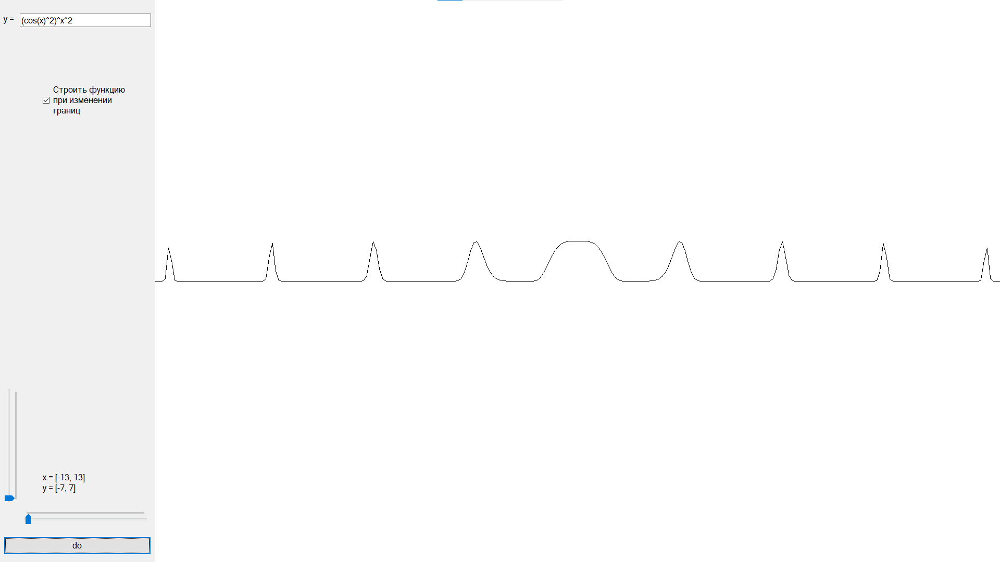
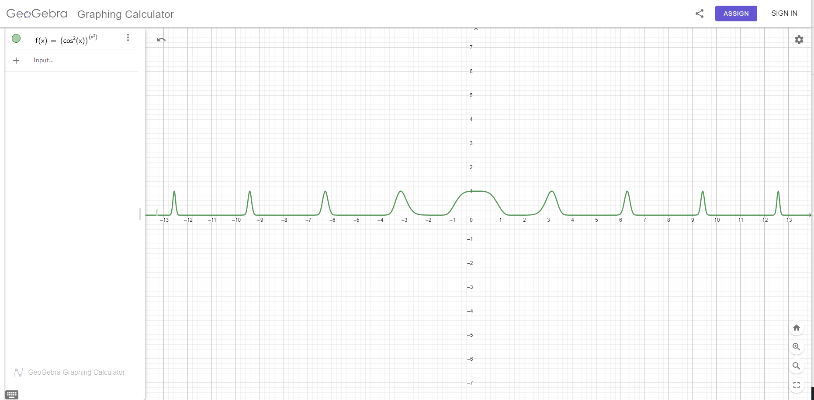

# Technology used
C#, WindowsForms, Bitmap

# Overview
In program I realised my own function reading algorithm and display this function on screen.

# About project
Before I've learned about [Reverse Polish Notation](https://en.wikipedia.org/wiki/Reverse_Polish_notation) I managed to make my own software implementation of the function reader.

## Program example

Compare it to some widely used function plotter like [this](https://www.geogebra.org/graphing)

The plotted function:

> $$
f(x) = {{\cos(x)}^2}^{x^2}
$$
## The idea
The idea is pretty easy and pretty stupid, but recalling the old programming adage:
> "if it's stupid and it works - it isn't stupid".

***The binary expression tree***

Let's say that there exists some function **f\(x\)** and we want to display it.

The idea is to map input string of **f\(x\)** into array of indexes. Then whenever we want some value of **f\(x\)** of given **x** - we break the expression into a tree like this:

And calculate the tree from leaves to the root!

Simple!

## For example
If input string is

$$
f\(x\) = "sin\(x\) + x"
$$

The program converts input string into a index sequence:

$$
\[-8, -1, -2, -1\]
$$

Where

$$
\begin{align}
-8 & is & sin \\
-1 & is & x \\
-2 & is & + \\
\end{align}
$$

Then the second part comes in: I want value of **f\(0\)**

Calculate binary tree using shitcode algorithm:

$$
\begin{align}
 & & + \\
 & / & & \textbackslash \\
 & sin & & x \\
 & | \\
 & x \\
\end{align}
$$

And finally calculate binary tree itself for $x = 0$

$$
\left( \begin{align}
 & & + \\
 & / & & \textbackslash \\
 & sin & & 0 \\
 & | \\
 & 0 \\
\end{align} \right)
$$

$$
\left( \begin{align}
 & & + \\
 & / & & \textbackslash \\
 & sin0 & & 0 \\
\end{align} \right)
$$

$$
\left( \begin{align}
 & & + \\
 & / & & \textbackslash \\
 & 0 & & 0 \\
\end{align} \right)
$$

$$
\left( 0 + 0 \right)
$$

$$
\left( 0 \right)
$$

In result we have answer: $f\(0\) = 0$
